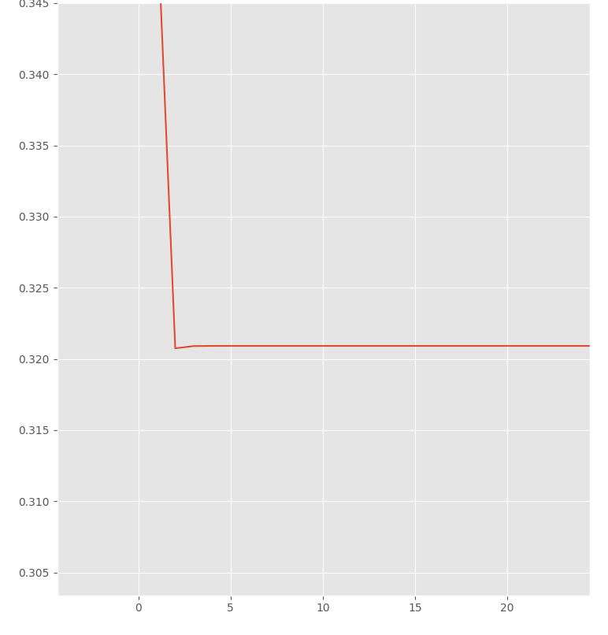

<h1>Отчет по реализации трех алгоритмов приближенного решения линейных уравнений</h1>

Уравнение используемое для исследования: x^3 + 2x^2 + 8x + 1 = 8cos(x) - 12sin(x)

Перенесем все элементы уравнения в левую часть, приравняв его к нулю. Получаем x^3 + 2x^2 + 8x + 1 - 8cos(x) + 12sin(x) = 0

<h2>Ручное исследование функции</h2>

Построим график y=x^3 + 2x^2 + 8x + 1 - 8cos(x) + 12sin(x)

По графику можно пронаблюдать, что ноль функции однозначно = xє(-10, 10)

<h2>Метод половинного деления (бисекции)</h2>

Пронаблюдаем график зависимости итоговых значений от заданой точности (точность=10^-(x))

Видим постепенный выход значений на плато

Осмотрев графики зависимости количества итераций от точности заметим, что выход на плато происходит на 48 итерации

Самой вероятной причиной выхода на плато является ограничение объекта float самого ЯП

Для проверки точности проверим тот же метод на уравнении x + 1.148814881488 = 0

Очевидно, что корень этого уравнения: x = -1.148814881488

Подставив в метод точность 0.00000001 и сохранив лимиты в (-10, 10) за 30 итераций получаем ответ -1.1488148756325245

Можем сделать вывод, что метод выполняется за большое количество итераций и при этои имеет низкую точность

<h2>Метод хорд</h2>

Аналогично с методом бисекции пронаблюдаем графики

Зависимость значений от точности:

Также видим плато

График зависимости количества итераций от точности:

Выход на плато происходит за 14 итерации

Также проверим точность на уравнении x + 1.148814881488 = 0

Также подставляем точность 0.00000001 и лимиты (-10, 10). Получаем ответ -1.148814881488 за 2 итерации

<h2>Метод Нютона</h2>

Я не понял, что надо сделать

В приведенной статье как будто описывается метод бисекции, а найденый в интернете алгоритм требует взятия производной, что звучит неправильно (это и сложно и долго)

<h2>Сравнение методов</h2>

Оранжевые графики - бисекция, синии графики - хордование

При сверхнизких значениях переменнной точности значения примерно равны до 17 цифры после запятой

Однако как было видно по вышеописанным анализам метод бисекции требует значительно больше итераций

<h3>Итого: любите маму пацаны</h3>
