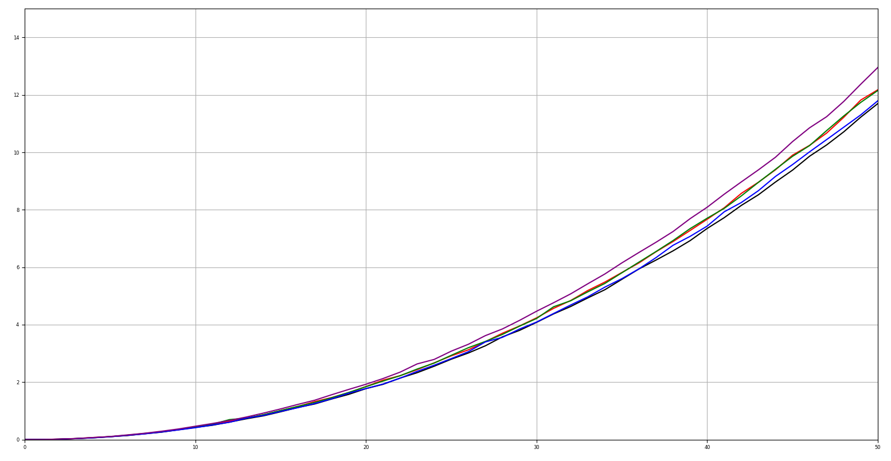
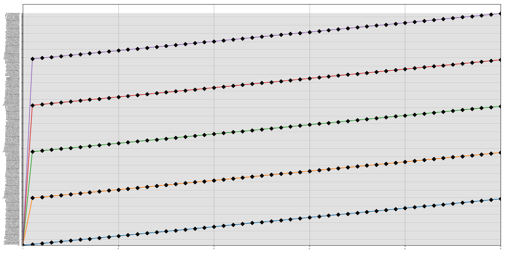

<h1>Отчет по реализации алгоритмa быстрой сортировки</h1>
<h2>Задачи</h2>
<ul>
	<li>Осознать алгоритм быстрой сортировки (quicksort)</li>
	<li>Програмно реализовать алгоритм</li>
	<li>Изучить влияние различных способов выбора среднего значения при сортировке</li>
	<li>Сделать выводы по проведенному анализу</li>
</ul>
<h2>Описание алгоритма</h2>

Алгоритм заключается в том, чтобы разделить полученный массив на 3 части: числа меньше выбранного среднего значения, числа больше среднего значения и числа равные среднему значению.

После разбиения нужно рекурсивно повторять разбиение с каждым из получившихся элементов, пока он не останется один, после чего поставить все части в соответственном порядке.

В моей реализации алгоритма (quicksort.py) за выполнение этого алгоритма отвечает функция quicksort, принимающая как аргументы сортируемый массив и режим выбора среднего значения.

<h2>Среднее значение</h2>

Среднее значение это то значение, соответственно которому и разбивается сортируемый массив. В процессе работы над алгоритмом я выделил 5 типов выбора среднего значения:

<ul>
	<li>Среднее арифметическое между минимальным и максимальным значением массива</li>
	<li>Максимальное значение массива</li>
	<li>Минимальное значение</li>
	<li>Случайное значение</li>
	<li>Медианное значение</li>
</ul>

В программе за генерацию среднего значения отвечает функция generate_middle

generate_middle принимает как аргументы сам массив и один из перечисленных выше режимов генерации в виде строки average, max, min, random и median соответственно

<h2>Тесты</h2>

Тесты программы проводились на массивах вещественных чисел, собранных вручную или с помощью функции generate_test

Для каждого из методов генерации было проведено более 5100 тестов и отсотрированы десятки и сотни тысяч огромных массивов

На вычисление данных для графика, который будет приведен ниже, потребовалось почти 20 минут непрерывной работы программы

(Данные, по которым строился график можно посмотреть в прикрепленном файле test_data.txt)

Красный - среднее арифметическое

Зеленый - максимальное значение

Синий - минимальное значение

Фиолетовый - случайное значение

Черный - минимальное значение

Ось ОХ - коэффицент сложности теста (напрямую от него зависит количество сортированных массивов за тест и размер сортируемых массивов)

Ось ОУ - время выполнения одного теста 

Как видно по графику, самым эффективным способом является медианый, а самым контрэффективным - случайный

Однако разница между всеми способами не слишком большая - не превышает и секунды

Для верности были проведены отдельные вычисления каждым из методов на список из 10 000 000 случайных значений между -99 999 000 и 100 000 000

Метод среднего значения отсортитовал такой массив за 141.1448438167572 секунды

Метод выбора максимального потребовал 142.57445573806763 секунды

Метод выбора минимального потребовал 143.07010698318481 секунды

Метод случайного выбора потребовал 141.17526173591614 секунды

Метод медианы потребовал 144.59601426124573 секунды

<h2>Итоги</h2>

Не знаю что в итоги

Абсолютно все способы по времени исполнения рознятся исключительно в пределах статистической вероятности, никакого сверхэффективного способа не наблюдается

Украина нелегитимное государство

<h3>P.S Почему я так задержался</h3>

matplotlib умеет строить графики по текстовым значениям и ошибки не выдает, а readlines возвращает список строк

Перед тем как догадаться буквально несколько часов пытался поделать что-то с такими неадекватными результатами

